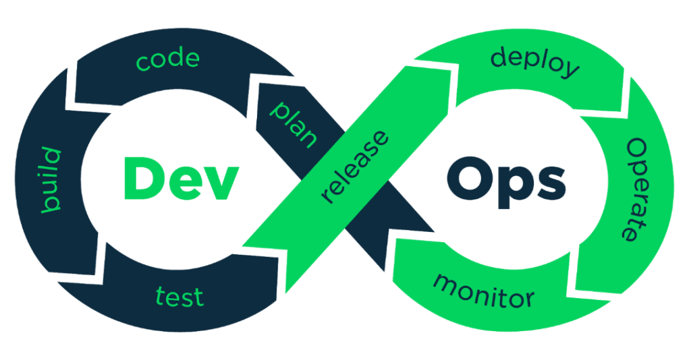
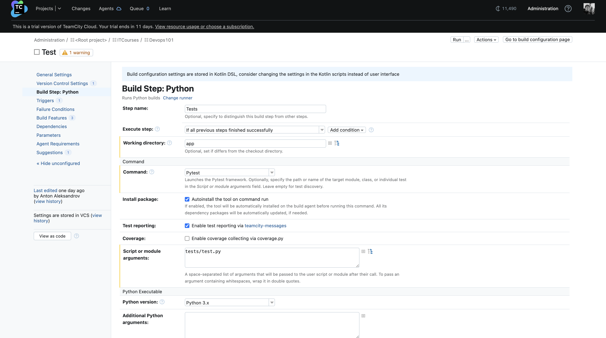

# Devops101: culture vs job title

This repository illustrates step-by-step journey of DevOps transformation of a single app/product.

*This repository was created solely for illustratory purposes and does not imply usage of best practices in terms of
technologies.*

## DevOps cycle

DevOps lifecycle is a combination of different phases of continuous software development, integration, testing,
deployment, and monitoring. A competent DevOps lifecycle is necessary to leverage the full benefits of the DevOps
methodology.

In this repository, this process will be illustrated on a smaller scale(one Hello World Flask app). However, the same
practices could be applied on a larger scale.

## What's the situation?

Assume you are DevOps engineer working in a company *A*. You have just been assigned to a product team that builds
product called *Hello World* app. This is a collaborative project about 5 software engineers are working on it. It is
your job to apply DevOps practices to make sure that:

1. The application is tested before release.
2. Changes to the application can be done as quickly as possible.
3. The application runs at all times, and we might need to scale quickly.
4. The application is monitored for both metrics and logs.
5. The system is extensible and new integrations can be delivered painlessly.

Let's assume also for now, that only one folder exists - `./app`. In this folder, there's a simple Flask application
that can only accept GET requests on root path. There are also a few tests in `./app/tests` folder. We can
see `Dockerfile` and `requirements.txt` files also.

Based on the given facts, we can already identify different stages of DevOps cycle we need to fulfill.

* Requirement 1 shows that we need to automatically test code and make sure no new bugs are not introduced. This is
  known as Continuous Integration.
* Requirement 2 implies that we need to have automation around application delivery process also known as Continuous
  Delivery.
* Requirement 3 emphases application availability for the customers. This is deploy and operate stages of DevOps cycle.
* Requirement 4 is about monitoring and operating the system. What do we need to do to have maximum level of insights
  about the application?
* Requirement 5 is about planning as well as deploy phases. Where do we deploy this application in order to ensure that?

## What can we already see?

We can already see some technologies used in the project - Python(Flask), PyTest, Docker.

Since automation has been mentioned already a few times we need to use CI/CD tool. Using tools such as TeamCity or
GitHub Actions we can make sure that process is repeatable and automatic.
Hence, our automation will be built around CI/CD tools. In our case it will be TeamCity offered
by [TeamCity Cloud](https://www.jetbrains.com/teamcity/cloud/).

There's scalability requirement we have, so we will deploy this application to a cloud provider. Either cloud provider
is fine for a small case like this. We will use AWS as the most popular one. In more complex systems options have to be
carefully considered due to potential high costs of provider specifics.

## Requirement 1 and 2

There are number of practices we can adopt to satisfy these requirements. One of the being defining Git Branching
strategy.

There are a number of such strategies available such
as [GitFlow](https://www.atlassian.com/git/tutorials/comparing-workflows/gitflow-workflow)
or [Trunk-Based](https://trunkbaseddevelopment.com/). We will use single long-lived branch `main` to which push is
restricted and only tested pull requests can be merged.

The idea is: we can test code when it's pushed to feature branch hence checking before review if this code passes our
tests. Once the feature branch is merged into `main` we can build and deploy code immediately. This way we make sure
that tested code ends up deployed as quick as possible. Additionally, there's a little room for error since it's done
automatically using CI/CD.

Below you can see how to enable this in GitHub:

Additionally, we will enable status checks. This is a callback from CI/CD systems that confirms that everything runs as
expected. In our case, we will enable check for Tests.

Next, we need to configure running tests in TeamCity:

First, create a project.

Create build configuration.

Add a build step to the build configuration. This step will install dependencies from `requirements.txt` and
run `pytest`

Add VCS trigger. This will make sure that test are ran everytime you push code.

Add Pull Requests and Commit status publisher build features, so TeamCity knows about Pull Requests and sends statuses
back when code is ran.

Now, when you open a pull request in GitHub, a build on TeamCity should be triggered.

After a while TeamCity will finish the build and report status check back.

Now, let's make sure that we build the app after it was merged. Since the app already has a Dockerfile we will build and
push Docker image to Docker Hub.

Also, two build steps need to be added. One is for building the image and second one for push operation.

In the end, Docker support needs to be enabled to establish password protected access for Docker push.

Let's merge the pull request we have opened before. If we wait a minute, a new build will be triggered in Build
configuration.

It's important to mention that TeamCity enables users to use Kotlin DSL. A detailed explanation what is it and how it
works can be found [here](https://www.jetbrains.com/help/teamcity/kotlin-dsl.html).
The basic idea is that instead of configuring every build using UI in TeamCity like we did before, we can use Kotlin
code to create builds and other configurations inside Teamcity.

Why is it important?

Well, it's in ideology of DevOps that we aim to create code-centric system whereas much as possible is done by code.
Usage of code gives us advantages of both git(think of version control and change history) and ability to restore
configurations in the case of one of the components failing.

Example of TeamCity Kotlin DSL can be found in `./.teamcity` folder.

## Requirement 3,4 and 5

These requirement cover deploy, operator and monitor phases of DevOps cycle.

### Deploy

How do we deploy and where do we deploy are two main questions to be asked here. If we are talking about cloud providers
like AWS or GCP, we are looking at multiple services that can deploy Docker images.
In this example, we will use [AWS ECS](https://aws.amazon.com/ecs/) to run our application.

However, ECS still requires configurations in order to run a Docker container. One option is to click through AWS
Console and create all necessary resources. Yet we see that this approach is cumbersome, prone to human error and simple
boring. Not to mention that if AWS suddenly collapses for whatever reason we need to be able to recreate our setup from
scratch.

Infrastructure as a Code(IaC) to the rescue.

*"Infrastructure as code (IaC) uses DevOps methodology and versioning with a descriptive model to define and deploy
infrastructure, such as networks, virtual machines, load balancers, and connection topologies. Just as the same source
code always generates the same binary, an IaC model generates the same environment every time it deploys."*

(c) Microsoft documentation

There is a number of options available on the market. There IaC solely built for cloud providers like [AWS CloudFormation](https://aws.amazon.com/cloudformation/)
or [Azure Resource Manager](https://learn.microsoft.com/en-us/azure/azure-resource-manager/management/overview). There are tools built independently of cloud providers and can be considered cloud-agnostic
like [Hashicorp Terraform](https://www.terraform.io/) and [Pulumi](https://www.pulumi.com/).

How to choose the right one? 

Well, each of them covers a specific case and imposes own limitations. However, undeniably Terraform is the most popular.

Hence, we will use Terraform here.

Since we are not aiming to cover all concepts of Terraform here, so it's suggested to check out [this article](https://itnext.io/terraform-for-beginners-dd8701c1ebdd) or [this article](https://developer.hashicorp.com/terraform/intro) before continuing.

Terraform code for this project is stored in `./infrastructure` folder. Here's a brief overview of the files inside:

1. `config.tf` - configures connection to AWS
2. `variables.tf` - input configuration we might want to change
3. `data.tf` - contains queries about resources in AWS
4. `main.tf` - declaration of resources
5. `outputs.tf` - values that we want to export

Terraform can be run using `terraform plan` command which produces a long list of resources to be created. Basically, Terraform scans what is created in our AWS account already and compares our declarations([documentation](https://developer.hashicorp.com/terraform/tutorials/cli/plan)). If resources are not created like in our case, Terraform will show a list of resources to be created.

We can apply these resources using `terraform apply` command.

What is important for us is that using Terraform code we can fulfil operate and monitor stages. AWS already provides us with services like AWS CloudWatch and ECS monitoring. That means in Terraform we can not only create cloud infrastructure, but also solutions for each stage of DevOps cycle.

Since Terraform is code we can deploy it using our CI/CD tool - TeamCity. In our case, let's implement the following:

1. Once a feature is merged into main, we will build a Docker image.
2. Once the image is built, it's deployed using Terraform.

In the case of TeamCity, this is done using [Snapshot Dependencies](https://www.jetbrains.com/help/teamcity/snapshot-dependencies.html) and [Reverse dependency parameters](https://www.jetbrains.com/help/teamcity/snapshot-dependencies.html#:~:text=It%20must%20have%20no%20customized%20parameters%2C%20including%20those%20set%20via%20reverse.dep.%20parameters%20(related%20feature%20request%3A%20TW%2D23700).)

For that a new configuration needs to be created:

We will run Terraform init and apply commands with an argument from Build configuration.

In order for that to work, we will add a dependency on Build configuration

Finally, we need to do small adjustment in Build image and Push build steps

### Operate and monitor

As for these phases, our Terraform configuration already contains operational tools and monitoring tools. 
For example, CPU and Memory can be seen in ECS dashboard. 

While logs are available in CloudWatch.

